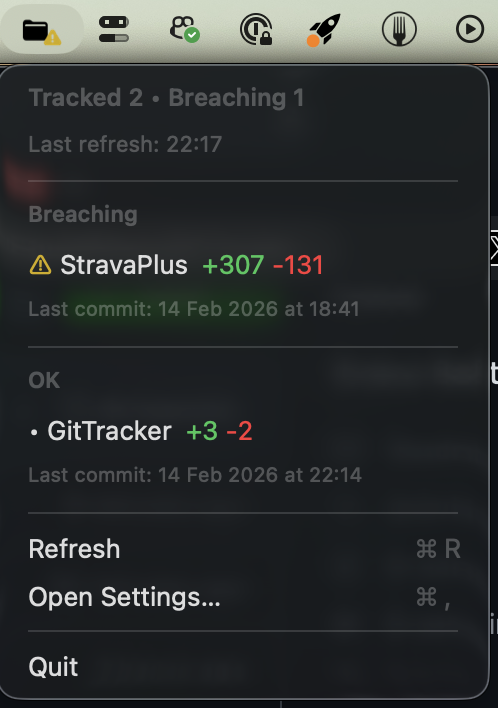

# GitTracker

GitTracker is a native macOS menu bar app for tracking per-project uncommitted git line deltas (`+++`/`---`) and alerting when thresholds are exceeded.

## Screenshot


## Features
- Track exact project folders.
- Track wildcard roots (`folder/*`) to include immediate child git repositories.
- See live `+added` / `-removed` counts in the menu bar dropdown.
- Configure global thresholds with optional per-project overrides.
- Get menu bar warning state and macOS notifications on breach transitions.

## Defaults
- Thresholds: `+200 / -200 / total 300`
- Refresh interval: every 2 minutes
- Notification mode: transition-only (no repeated spam while still breached)

## Requirements
- macOS 14+
- Xcode 16+ or Swift 6 toolchain

## Install with Homebrew
```bash
brew tap RuiAAPeres/gittracker
brew install --cask gittracker
```

## Update to latest release
```bash
brew upgrade --cask gittracker
```

## Build and run
```bash
swift run GitTracker
```

## Run tests
```bash
swift test
```

## Usage
1. Launch the app.
2. Open `Settings` from the menu bar dropdown.
3. Add either:
   - exact path: `/Users/you/Code/MyRepo`
   - wildcard root: `/Users/you/Code/*`
4. Adjust thresholds and refresh cadence.
5. Watch the menu bar icon/title for breach count and open the menu for per-project details.

## Automated releases
- Create and push a tag like `v1.0.0`.
- The release workflow will:
  - build zipped app bundles for `arm64` and `x86_64`
  - publish those artifacts in a GitHub Release
  - update `RuiAAPeres/homebrew-gittracker` cask (if `HOMEBREW_TAP_TOKEN` secret is set)
